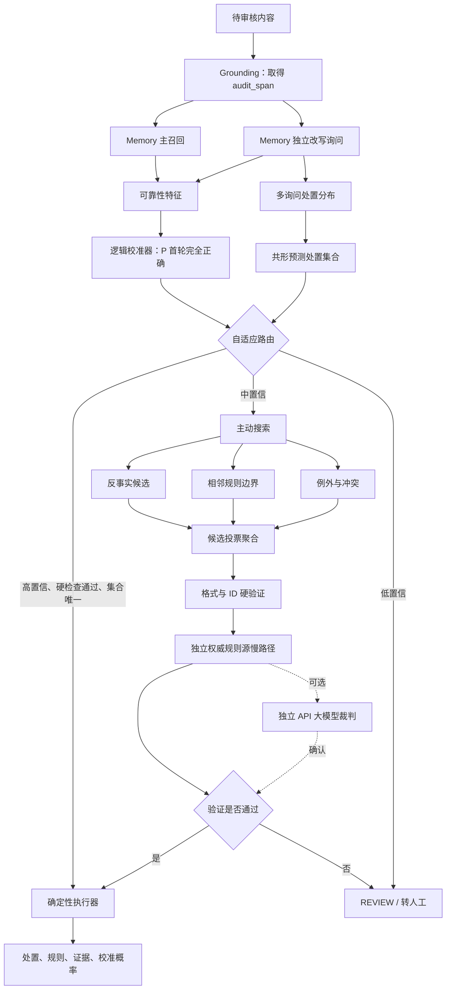

# 第 27 课：CA-MeMo——带校准、主动搜索和独立验证的模型化记忆

本课在第 26 课 [MeMo 规则记忆](../26_memo_rule_memory/README.md) 的真实 `Qwen3.5-0.8B-Base` Memory 检查点上增加三种能力：

1. 用外部统计方法判断 Memory 本次回忆是否可信，而不是相信模型自报 `confidence`；
2. 只对中置信案例展开反事实、边界和例外搜索；
3. 用独立权威规则源验证 Memory，低置信或 OOD 内容拒答为 `REVIEW`。

本课把这套系统称为 **CA-MeMo（Calibrated and Adaptive Memory as a Model）**。它是基于 MeMo 的教学研究扩展，不是 MeMo 原论文提出的算法，也不声称已经获得论文级创新结论。

数据通用格式见 [CA-MeMo 数据说明](../../datasets/calibrated_adaptive_memo/README.md)，本机真实数值、失败案例和结论见 [实验结果](RESULTS.md)。

## 要解决的问题

第 26 课的最佳确定性方案在 120 条合成审核数据上达到 97.50%，但还存在三个关键盲区：

- Memory 记错相邻规则时，确定性执行器会稳定地执行错误规则；
- 同一个 Memory 多问几次可能重复相同的参数错误，不能算独立验证；
- Memory 训练样本默认“每问必有规则”，面对规则库没有覆盖的内容可能强行匹配。

CA-MeMo 的核心研究问题是：

> 参数化 Memory 能否在不改 Executive 参数的前提下，知道自己什么时候记得、什么时候需要继续搜索、什么时候必须请求帮助？

## 推理流程



高置信分支仍然主要使用参数化 Memory，权威检索只是困难样本的安全慢路径，因此系统没有退化成“每条内容都做普通 RAG”。

## 目录

| 文件 | 作用 |
|---|---|
| `prepare_data.py` | 生成严格拆分且场景平衡的校准集和测试集 |
| `inference_backend.py` | 官方 ms-swift 4.4.3 本地后端与无 logprobs 的 API 黑盒后端 |
| `ca_memo_core.py` | 特征、校准、共形集合、主动问题、验证器和全部指标 |
| `run_experiment.py` | 七组对照、可恢复生成缓存和完整轨迹导出 |
| `export_results.py` | 将被忽略的大型轨迹提炼为可提交结果摘要 |
| `run_full_course.sh` | 数据、测试、真实实验和结果导出的一键入口 |
| `test_ca_memo.py` | 拆分、黑盒特征、校准、共形和独立验证测试 |
| `.env.example` | API 环境变量占位符，不含真实密钥 |

## 数据设计

校准集和最终测试集各 72 条，分别来自已有四分类数据的 SFT 新闻与验证新闻，二者不共享 `record_id` 或审核片段。每个拆分都包含：

```text
4 个领域
× 6 种场景
× 每场景每领域 3 条
= 72 条
```

六种场景是普通规则、相邻边界、无规则/OOD、多规则冲突、绑定例外和对抗改写。校准集只用于拟合统计量，测试集只在所有模型和阈值冻结后评分。

## 可靠性特征

每个案例先对同一个 Memory 做两次不同视角的查询。系统只从响应行为提取下列特征，不读取 `gold_*`：

| 特征 | 含义 | API 无 logprobs 时 |
|---|---|---|
| `mean_logprob` | 实际生成 token 的平均对数概率 | 使用固定缺省值 `-5` |
| `has_logprobs` | 两次响应中可取得概率的比例 | `0`，让校准器知道概率缺失 |
| `query_id_agreement` | 两次规则 ID 集合的 Jaccard 一致率 | 正常计算 |
| `decision_agreement` | 两次基础处置是否一致 | 正常计算 |
| `stage_consistency` | ID 与处置一致性的平均 | 正常计算 |
| `valid_id_rate` | 原始生成 ID 在稳定注册表中存在的比例 | 正常计算 |
| `fact_completeness` | 规则、处置、事实和优先级字段完整度 | 正常计算 |
| `exception_conflict` | 例外、处置或优先级是否互相矛盾 | 正常计算 |
| `semantic_entropy` | 按“规则集合+处置”语义簇计算的归一化熵 | 正常计算 |
| `no_match_rate` | 两次响应返回空规则的比例 | 正常计算 |
| `mean_rule_count` | 平均候选规则数量 | 正常计算 |

Memory 生成文本中的任何 `confidence` 字段都会被忽略。白盒 logprob 也只是特征之一，必须经过独立校准，不能直接当正确率。

## 校准标签与逻辑校准器

校准标签定义得比较严格：

```text
首轮规则集合完全等于 gold_rule_ids
并且
确定性执行后的 decision 等于 gold_decision
```

满足两项才记为 `1`。本课实现一个带 L2 和类别均衡权重的 Logistic Regression，不依赖额外的 `sklearn`：

\[
P(\mathrm{correct}\mid x)=\sigma(w^T\hat{x}+b)
\]

拟合仅使用 `calibration.jsonl`。路由阈值也只从校准概率选择：高阈值优先满足较高自动接受精度，低阈值使用校准概率分位点，从而保留一个中置信搜索区间。

## 共形预测处置集合

两次 Memory 查询形成 `PASS/REVIEW/REJECT` 的平滑频率分布。对校准集金标签计算非一致性分数：

\[
s_i=1-p_i(y_i)
\]

再使用有限样本修正分位数取得阈值。推理时返回所有满足 `1-p(y) ≤ q` 的处置。高置信直通不仅要求校准概率高，还要求：

- 硬验证通过；
- 共形集合只有一个处置。

共形保证依赖校准集和测试集可交换等假设。真实分布漂移、时间变化或合成数据都可能破坏保证，所以报告同时给出最终测试集的经验覆盖率和平均集合大小。

## 主动搜索

中置信样本不是机械重复同一句问题，而是固定展开三个互补分支：

```text
反事实：如果首轮候选不适用，最接近的相邻规则是什么？
边界辨析：候选与相邻规则的必要条件差异是什么？
例外冲突：是否还有允许例外、第二条风险规则或更高优先级规则？
```

两次快速查询加三个分支形成最多五个候选。聚合器按规则 ID 投票；完整候选轨迹会保存到被 Git 忽略的 `outputs/`，便于判断是 `Pass@N` 不足，还是验证器 `Pick@N` 失败。

## 三层独立验证

1. **硬验证**：检查 JSON、合法 ID、领域、事实和处置字段；
2. **Memory 交叉询问**：检查同一参数记忆的内部一致性，但不把它冒充独立事实来源；
3. **权威规则源慢路径**：对 `audit_span` 的独立片段做 BM25 检索，用校准集拟合 OOD 分界，并允许纠正错误候选。

可选 API 裁判只看到聚合候选和最多几条权威规则，不读取完整规则库或金标签。API 裁判仍可能错误，因此它是附加确认层，不替代确定性 ID/规则检查。

## 七组对照

| 方法 | Memory 调用 | 独立权威源 | 目的 |
|---|---:|---:|---|
| `memory_single` | 1 | 否 | 单轮低成本基线 |
| `fixed_three_stage` | 3 | 否 | 第 26 课固定结构化协议 |
| `simple_vote` | 3 | 否 | 检查“多问几次”是否足够 |
| `calibrated_route` | 2 | 否 | 只校准和拒答，不搜索 |
| `calibrated_search` | 2 或 5 | 否 | 校准加主动搜索 |
| `calibrated_search_verifier` | 2 或 5 | 是 | 完整 CA-MeMo |
| `all_authority_rules` | 0 | 每条都访问 | 高成本参考上界，不是参数 Memory 方法 |

这里的 `all_authority_rules` 表示每条案例都访问权威规则索引，不会读取金规则；它不是 Oracle 标签泄漏上界。

## 指标

| 指标 | 含义 |
|---|---|
| Accuracy / Macro-F1 | 所有案例的处置质量；拒答统一输出 REVIEW，因此高风险案例拒答仍会降低总体准确率 |
| 规则 Precision / Recall / F1 | 最终规则集合是否完整 |
| Complete Accuracy | 处置与完整规则集同时正确的比例 |
| ECE / Brier | 置信信号对其目标事件的校准误差；自适应方法的目标是“首轮处置+规则集完全正确” |
| Coverage | 自动接受比例 |
| Selective Risk | 自动接受案例中的错误率 |
| AURC | 风险—覆盖率曲线面积，越低越好 |
| OOD False Accept Rate | 无规则案例被自动接受的比例，越低越好 |
| Search Rescue Rate | 首轮未完全正确案例中，搜索后处置与完整规则集均修复且自动接受的比例 |
| Pick@N | 候选中存在完整金规则时，最终选择器选对的比例 |
| 共形经验覆盖 / 集合大小 | 金处置是否落在候选集合内，以及集合是否过宽 |
| 平均调用、token、延迟、API 成本 | 准确性之外的推理代价；本地延迟是批处理总时间均摊值 |

`Selective Risk` 只按最终处置是否正确计算；报告还会单独给出覆盖内的“处置+规则集”完全错误率。对自适应方法，ECE、Brier 和 AURC 校验的是校准器真正拟合的首轮完全正确事件，不会把验证器后续纠错的结果倒灌进校准指标。

## ms-swift 4.4.3 版本说明

截至本课实验日期，PyPI 只列到 `ms-swift 4.4.2`，因此一键脚本从官方 GitHub 的 `v4.4.3` 标签加载源码。该标签提交为：

```text
e1287928be4451b9ed5e2fb00a24ad3c8f61287b
```

需要特别注意：这个官方标签的 `swift/version.py` 内部仍报告 `4.5.0.dev0`。课程不会擅自改官方源码，而是在每次本地实验中同时强校验 Git 标签和提交哈希，并把内部字符串如实写入 `experiment_config.json`。所以判定使用了 4.4.3 的权威证据是标签与提交，而不是错误的内部字符串。

## 一键复现

第 26 课最佳检查点仍在默认位置时：

```bash
source ./activate.sh
bash course/27_calibrated_adaptive_memo/run_full_course.sh
```

更换检查点和批量大小：

```bash
MEMORY_MODEL=/mnt/workspace/你的Memory检查点 \
BATCH_SIZE=128 \
bash course/27_calibrated_adaptive_memo/run_full_course.sh
```

脚本会复用已有模型，不下载或复制权重。大型生成缓存、逐条轨迹和日志只写入 `/mnt/workspace/ms-swift-learn/outputs/27_calibrated_adaptive_memo/`，已经由根目录 `.gitignore` 排除。

## API 黑盒 Memory

API 不支持 logprobs 也可以运行：

```bash
export DASHSCOPE_API_KEY='只在当前终端设置'

python course/27_calibrated_adaptive_memo/run_experiment.py \
  --memory-backend api \
  --memory-model 你部署的Memory模型名 \
  --memory-base-url https://dashscope.aliyuncs.com/compatible-mode/v1 \
  --request-logprobs false \
  --api-key-env DASHSCOPE_API_KEY
```

远程 Memory 必须是已经训练了私有规则的模型，不能用普通聊天模型冒充。代码只读取环境变量；不会打印、保存或提交 Key。

## 可选 API 裁判

在完整验证方法的中置信慢路径增加独立裁判：

```bash
python course/27_calibrated_adaptive_memo/run_experiment.py \
  --memory-model /mnt/workspace/Memory检查点 \
  --judge-backend api \
  --judge-model 你购买的模型名 \
  --judge-base-url https://dashscope.aliyuncs.com/compatible-mode/v1 \
  --api-key-env DASHSCOPE_API_KEY
```

可用 `--input-price-per-million` 和 `--output-price-per-million` 填入当前供应商价格，报告会按真实 usage token 估算费用。默认价格为零，避免把过期价格硬编码进课程。

## 实验注意事项

1. 校准集不能兼做测试集；调过阈值后再汇报同一批数据会产生乐观偏差。
2. OOD 必须训练和评测“空规则”行为，否则拒答能力无法被识别。
3. 同一个 Memory 的交叉询问只能作为一致性证据，不能替代权威规则源。
4. Accuracy 和 Coverage 必须一起看；把所有样本都拒答可以降低风险，却没有业务价值。
5. 完整权威检索是参考上界，不应与参数化 Memory 的调用成本混为一谈。
6. 合成数据只能验证系统链路；上线前要换成法务确认规则和时间外、双人标注的真实内容。
