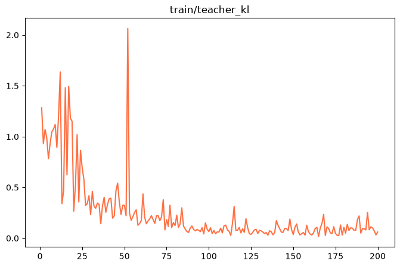
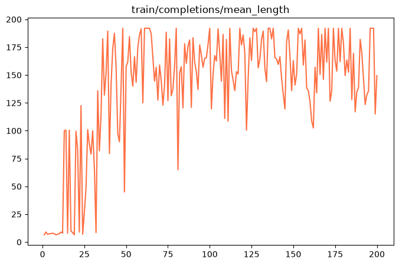
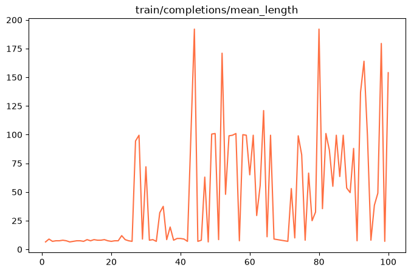
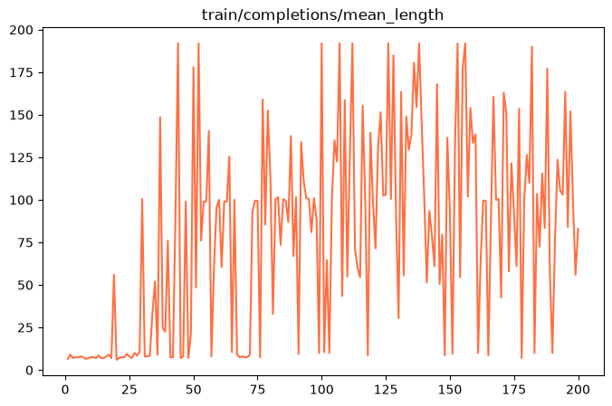
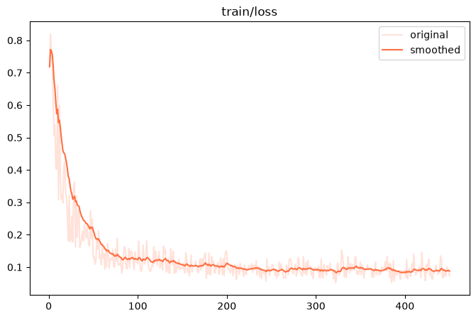
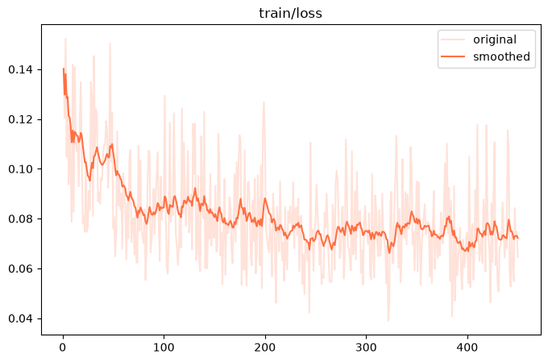

# 实验结果

本目录只保留适合进入 Git 的小型实验材料，不包含任何模型权重或训练检查点。

## 目录说明

- `evaluations/`：33 组固定 100 条验证题的逐题生成结果，共约 4MB。
- `figures/`：从 780 张自动生成曲线中精选的 13 张教学图。

所有评测使用温度 0 和最多 256 个新 token。评分逻辑见 `course/07_tuning/score_gsm8k.py`，完整结论见 [多轮训练与参数对照](../course/TUNING_RESULTS.md)。

## 关键结果

| 方法 | 正确率 | 格式率 | 平均输出字符数 |
|---|---:|---:|---:|
| CoT-OPD，200 步 | **58%** | 76% | 583 |
| CoT-GKD，batch 2，1 轮，`beta=0` | 57% | 72% | 545 |
| CoT-GKD，batch 16，2 轮，`beta=0` | 55% | 67% | 563 |
| MOPD，200 步 | 28% | 92% | 276 |
| CoT-LoRA 最佳方案 | 27% | 87% | 233 |

## 精选曲线

### OPD 教师信号与长度

### MOPD 100/200 步对照

### GKD 散度对照

